<!-- Typing intro -->

[!;Fullstack+Web+Developer+%7C+Crafting+Reusable+Web+Systems;Welcome+to+my+GitHub+space!>)](https://git.io/typing-svg)

  

---

### 👨‍💻 About Me

- 💼 Fullstack Web Developer at **ID Solutions**
- 💬 You can ask me anything about frontend, backend, APIs, or tooling
- 📫 Reach me: [LinkedIn](https://www.linkedin.com/in/hadi-miftahul-fadly-4a923b183/) | hadimiftahulf@gmail.com

---

### 🛠️ Tech Stack

---

### 📊 My GitHub Metrics Overview

  

### 🌱 Contribution Activity<

  

### ⌨️ WakaTime Stats

  

### 📬 Let’s Connect!

  
  

---

> _"Consistency beats motivation. Code like it's dhuhur — wajib, bukan sunnah."_ 🤍
